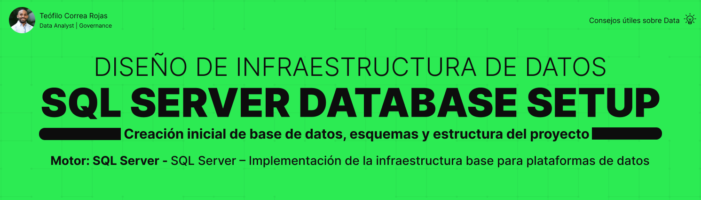

# PostgreSQL Database Infrastructure



## 📌 Descripción

Este proyecto tiene como objetivo construir la **infraestructura base de una plataforma de datos en PostgreSQL**, enfocándose en la creación de bases de datos, esquemas y scripts reutilizables.

El enfoque es progresivo, permitiendo desarrollar fundamentos sólidos en ingeniería de datos desde un nivel básico hasta intermedio.

---

## 🎯 Objetivos del proyecto

- Diseñar la estructura inicial de una base de datos
- Implementar esquemas organizados por capas
- Crear scripts SQL reutilizables (idempotentes)
- Documentar decisiones técnicas y de arquitectura
- Validar la correcta implementación del entorno

---

## 🧱 Estructura del proyecto

```text
PostgreSQL_Database_Infrastructure/
│
├── docs/
│   ├── idempotent_scripts_guidelines.md
│   ├── infraestructura_portada.png
│   ├── infrastructure_design_decisions.md
│   ├── medallion_architecture_notes.md
│   ├── naming_conventions.md
│   └── project_closure.md
│
├── outputs/
│
├── sql/
│   └── 00_setup/
│       ├── 02_create_schemas_basic.sql
│       ├── 05_validate_setup.sql
│       ├── 06_add_metadata.sql
│       └── 07_check_metadata.sql
│
├── .gitignore
└── README.md
```

---

## 👤 Autor

### Teófilo Correa Rojas
**Data Analytics | Data Engineering en formación**

🔗 [LinkedIn](https://www.linkedin.com/in/te%C3%B3filo-correa-rojas/)
